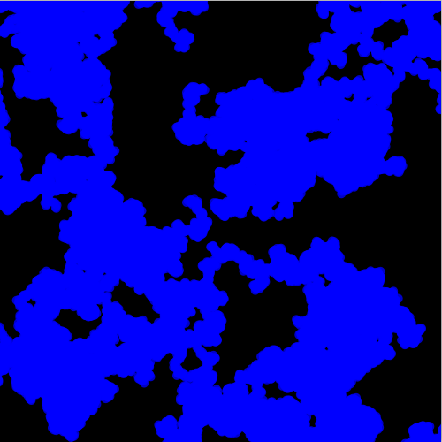

#  オブジェクトを使ってグラフィックを生成しよう

## グラフィックを作るための「粒子」

「Particle（粒子）」クラスを作ります。

```Java
class Particle{

  float x;
  float y;

  void drawParticle(){
    fill(0,0,255,200);
    ellipse(x,y,10,10);
  }

}
```

粒子を画面に表示するようにプログラムを作成します。

```Java

Particle p;

void setup(){
  size(500,500);
  p = new Particle();
}

void draw(){
  background(0);
  p.drawParticle();
}
```

## コンストラクタの役割

粒子を新しく作る時、粒子の位置座標を指定して生成できるようにします。

```Java
class Particle{

  float x;
  float y;

  Particle(float _x, float _y){  // <-  コンストラクタ（クラスメイト同じ名前の関数にする）
    x = _x;
    y = _y;
  }

  void drawParticle(){
    noStroke();
    fill(0,0,255,200);
    ellipse(x,y,10,10);
  }

}
```

コンストラクタに合わせて、「new Particle」を実行しているプログラムを変更します

```Java
void setup(){
  size(500,500);
  p = new Particle(100,100); // <- 粒子を座標 (100,100) に生成する
}
```

## 粒子を複数にして追加できるようにする

ArrayListをつかって、Particleを複数同時に管理します

```Java
ArrayList<Particle> particles;

void setup(){
  size(500,500);

  particles = new ArrayList<Particle>(); // <- ArrayListをつくる

  Particle p = new Particle(100,100); // <- Particleをつくる

  particles.add(p); // <- ArrayListにParticleを追加する
}

void draw(){
  background(0);

  for(int i = 0; i < particles.size(); i++ ){
    particles.get(i).drawParticle();
  }

}
```

- ArrayList<Particle> は、Particleオブジェクトを追加することができる入れ物クラスです。
- add 関数を使って、Particleオブジェクトpを、particlesに追加しています
- size 関数は、particlesの中に追加されているParticleオブジェクトの数を調べる関数です
- get 関数は、 指定した番号のparticleオブジェクトを取り出します。取り出したオブジェクトの関数を呼び出すこともできます。


## インタラクション：粒子を追加出来るようにしてみましょう

マウスを操作して、画面の好きなところに粒子を追加できるようにします。

```Java
void mousePressed(){
  Particle p = new Particle(mouseX, mouseY);
  particles.add(p);
}
```

イベント処理関数 mousePressed を使います。Particleのコンスタラクタにマウスの座標（mouseX,mouseY)を指定すると
マウスカーソルのある座標に粒子が追加されるようにできます。


## タブを使って、クラスとプログラム本体を別々に整理しよう

Processingのタブ機能をつかって、プログラムを分割します。

## Particleに動きを加えてみよう

「ランダムウォーク」という動きを粒子に加えてみます。
小さな生き物が動き回るようなグラフィックを見ることができます。

```Java
class Particle{

  float x;
  float y;

  Particle(float _x, float _y){  // <-  コンストラクタ（クラスメイト同じ名前の関数にする）
    x = _x;
    y = _y;
  }

  void drawParticle(){
    noStroke();
    fill(0,0,255,200);
    ellipse(x,y,10,10);

    x = x + random(-3,3); // <- x と y の座標を更新する
    y = y + random(-3,3);
  }

}
```

## 動きの軌跡が残るようにしてみよう

background(0)の実行を、drawからsetupに写してみると、粒子の移動した後が軌跡として
残るグラフィックになります。



プログラムに「思考」を与えて（今回の場合はランダムですが）プログラムの実行結果によって
生み出されるグラフィックデザインのことを「ジェネラティブデザイン(Generative Design)」
と呼んでいます。

プログラムで作成した粒子クラス（Particle)に、現実世界の物理法則を与えることで、実世界の出来事をプログラムで再現することができます。このような方法のことを「シミュレーション(Simulation)」と読んでいます。

もしも、人間が発見できていない法則をコンピュータが生み出した場合、そしてその法則によってデザインが作られた場合、

- それは「ジェネレート」なのでしょうか？
- それは「シミュレーション」なのでしょうか？
- それらとは違う「何か」なのでしょうか？
